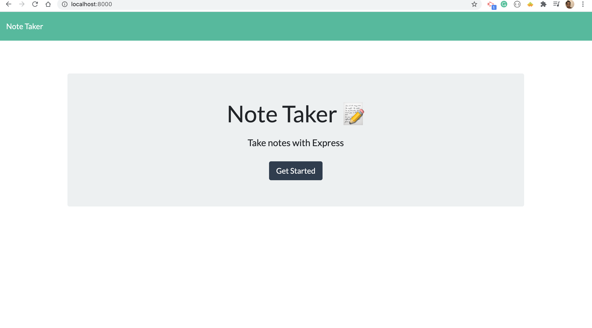
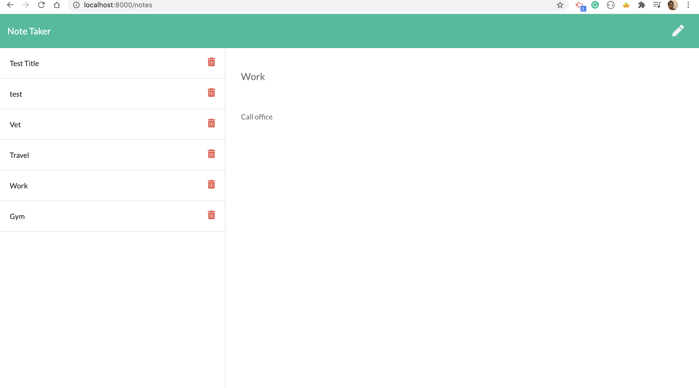
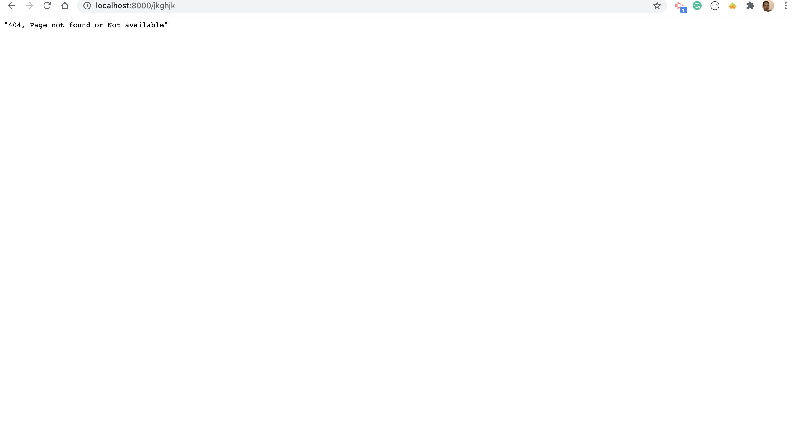

#  Project Title: Note-Taker

## Badges: 

 

## User Story 

* AS a user, I want to be able to write, save and delete notes to allow me to organize my thoughts and keep track of tasks I need to complete.

## Technology

- Nodejs
- Express
- JavaScript
- HTML/CSS

## Description: 

* For users that need to keep track of a lot of information, it's easy to forget or be unable to recall something important. Being able to take persistent notes allows users to have written information available when needed.

* The user can input any number of team members, and they may be a mix of engineers and interns. 
* Create and pass all unit tests. 
* When the user has completed building the team, the application will create an HTML file that displays a nicely formatted team roster based on the information provided by the user. 

* The application should be albe to do the following: 
    ** allow users to create and save notes.
    ** allow users to view previously saved notes.
    ** allow users to delete previously saved notes.

## Table of Content: 

* [Installation](#installation)  
* [Usage](#usage)
* [License](#license)
* [Contributors](#contributors)
* [Tests](#tests)
* [Questions](#questions)

## Installaion:
* npm i

## License: 
* MIT
# Contributing: 
* Pull request and stars are always welcome.
## Testing: 
* N/A

## Questions
If you have any questions, please contact at:   
Email: carolenesw@gmail.com

## link

* Repo link:
https://github.com/Carolenesw/Note-Taker

* Deployed URL:

https://notestake.herokuapp.com/

## Images

